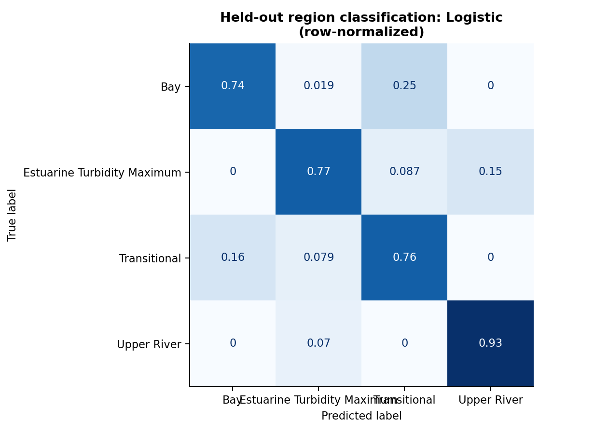
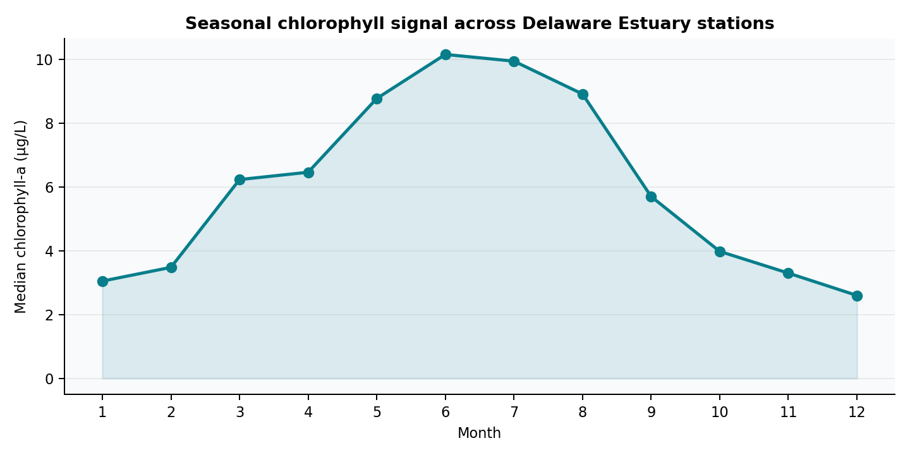
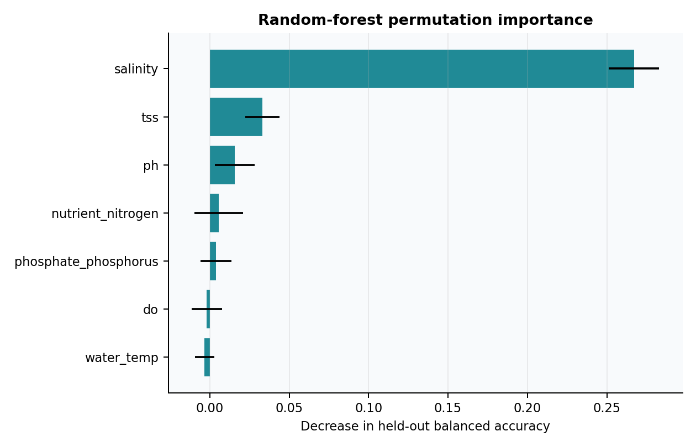
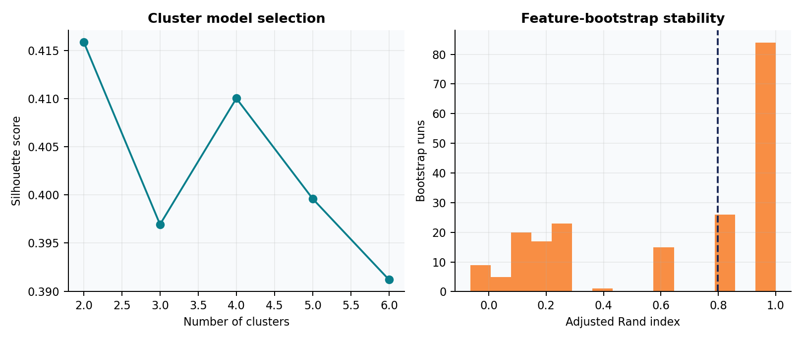

# enviroML

### Environmental machine learning from estuary observations to climate prediction

[](https://github.com/takyurp09/enviroML/actions/workflows/ci.yml)
[](https://www.python.org/)
[](https://scikit-learn.org/)
[](LICENSE)
[](CITATION.cff)

**enviroML** is a reproducible research project that applies statistical learning to two environmental systems: Delaware Estuary water quality and ERA5 near-surface climate data over Bangladesh. It demonstrates the complete workflow from data checks and feature engineering to model selection, held-out validation, interpretation, and stability analysis.

> **At a glance:** 3,346 estuary observations · 22 stations · 4 classification algorithms · 3 regression algorithms · 200 clustering stability refits · chronological climate validation

<p align="center">
  
  
</p>

## Research questions

1. How accurately can physicochemical measurements predict chlorophyll-a concentration?
2. Can water-quality variables distinguish ecological regions of the Delaware Estuary?
3. How many multivariate station regimes are supported, and are they stable to feature resampling?
4. How well do weather covariates and seasonal features predict future-period ERA5 temperature?

## Evidence and validation

Every headline number below is generated by [`src/run_pipeline.py`](src/run_pipeline.py) and recorded in a machine-readable table.

| Analysis | Validation design | Leading result | Evidence |
|---|---|---:|---|
| Chlorophyll-a regression | Fixed 75/25 holdout | RF RMSE **7.50 µg/L**, R² **0.464** | [`02_regression_comparison.csv`](results/tables/02_regression_comparison.csv) |
| Estuary-region classification | Repeated 5-fold CV + untouched 25% test | Logistic balanced accuracy **0.799** | [`03_classification_comparison.csv`](results/tables/03_classification_comparison.csv) |
| Regime discovery | Silhouette comparison, k=2…6 | k=2, silhouette **0.416** | [`05_cluster_selection.csv`](results/tables/05_cluster_selection.csv) |
| Cluster stability | 200 feature-bootstrap refits | Median ARI **0.798** | [`06_cluster_stability.csv`](results/tables/06_cluster_stability.csv) |
| Bangladesh temperature | First 75% train / final 25% test | Ridge RMSE **2.79°C**, R² **0.345** | [`07_climate_time_split.csv`](results/tables/07_climate_time_split.csv) |

These results demonstrate methods and validation discipline; they are not operational water-quality or weather forecasts. See [limitations and responsible use](docs/data-and-ethics.md).

## Methods represented

| Area | Implemented methods |
|---|---|
| Data engineering | Multi-file ingestion, schema harmonization, datetime parsing, physical range checks, missingness audit |
| Regression | Ordinary least squares, ridge regression, random forest |
| Classification | Multinomial logistic regression, tuned RBF-SVM, random forest, gradient boosting |
| Unsupervised learning | Standardization, K-means, silhouette selection, bootstrap stability with adjusted Rand index |
| Interpretation | Held-out permutation importance, normalized confusion matrix |
| Climate features | Cyclic hour/day-of-year encoding, chronological validation |
| Quality assurance | Fixed random seed, generated artifacts, smoke tests, GitHub Actions |

## Quick start

### Requirements

- Git
- Python **3.11 or newer**
- Approximately **1 GB free memory** and **250 MB disk space**
- macOS, Linux, or Windows; commands below use a POSIX shell

### 1. Clone and create an environment

```bash
git clone https://github.com/takyurp09/enviroML.git
cd enviroML
python3 -m venv .venv
source .venv/bin/activate
python -m pip install --upgrade pip
python -m pip install -r requirements.txt
```

Windows PowerShell activation: `.venv\Scripts\Activate.ps1`.

### 2. Stage the source data

Raw data are excluded until redistribution permissions and exact citations are verified. Follow [`data/README.md`](data/README.md) to create:

```text
data/raw/estuary/station-*.csv
data/raw/climate/era5_bangladesh_2000.csv
```

### 3. Run and verify

```bash
python src/run_pipeline.py
python tests/test_outputs.py
```

Or run both with `make all test`. A full run takes several minutes on a typical laptop. Randomized procedures use seed `638`.

To inspect the project without restricted raw data, browse the committed [figures](results/figures) and [metric tables](results/tables); CI verifies these published artifacts on every push.

## Project structure

```text
enviroML/
├── .github/workflows/ci.yml  # Automated integrity checks
├── data/README.md            # Input schema and staging instructions
├── src/run_pipeline.py       # End-to-end analysis entry point
├── tests/test_outputs.py     # Published-artifact smoke tests
├── results/
│   ├── figures/              # Six analysis and validation graphics
│   └── tables/               # Audits, metrics, importance, stability
├── docs/
│   ├── methodology.md        # Modeling and validation decisions
│   ├── validation.md         # Metric definitions and evidence map
│   ├── learning-journey.md   # Course sequence behind the methods
│   ├── provenance.md         # Original work versus later extensions
│   └── data-and-ethics.md    # Data rights, limitations, responsible use
├── environment.yml           # Cross-platform Conda environment
├── requirements.txt          # Runtime dependencies
├── requirements-dev.txt      # Development and QA dependencies
├── CONTRIBUTING.md           # Contribution and review expectations
├── CHANGELOG.md              # Version history
└── CITATION.cff              # Citation metadata
```

## Results gallery

<p align="center">
  
  
</p>
<p align="center">
  
  
</p>

## Origin and authorship

The research questions and initial implementations originated in **MAST 638 — Machine Learning for Marine Science**, taught by **Dr. Yun Li** at the University of Delaware in Fall 2023. Muhammad Taky Tahmid subsequently redesigned the work as this unified, reproducible project and added the validation, stability, interpretation, testing, and documentation layers. Details and AI-assistance disclosure are in [`docs/provenance.md`](docs/provenance.md).

## Citation and license

If you use this work, cite the metadata in [`CITATION.cff`](CITATION.cff). Source code is available under the [MIT License](LICENSE). The license does not grant rights to third-party data.

**Author:** Muhammad Taky Tahmid · University of Delaware
