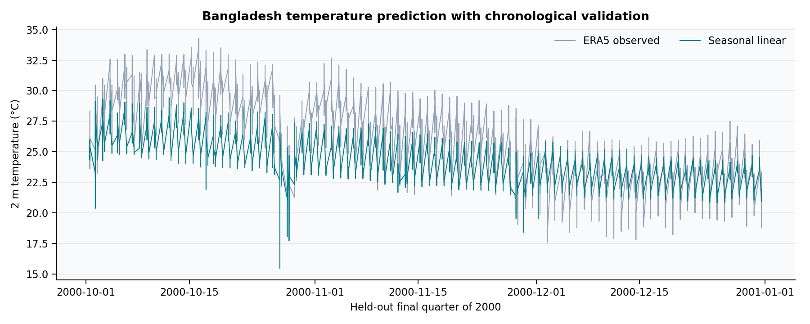
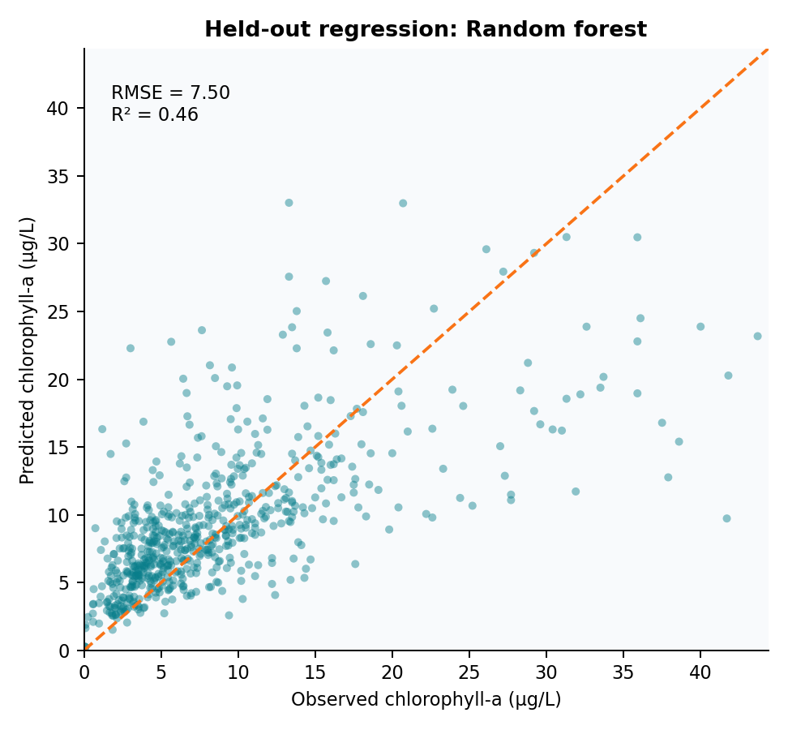

# Environmental Machine Learning

### From Estuary Observations to Climate Prediction

An end-to-end portfolio in environmental data engineering, supervised and unsupervised learning, neural networks, ensembles, and model validation.

**Muhammad Taky Tahmid**

Ph.D. candidate in Environmental Economics, University of Delaware

> Developed from assignments and a capstone completed in **MAST 638 — Machine Learning for Marine Science**, taught by **Dr. Yun Li** at the University of Delaware (Fall 2023). The repository redesign, reproducible pipeline, additional validation, and synthesis are post-course portfolio extensions.



## What this portfolio demonstrates

This project follows one coherent analytical arc: inspect environmental observations, establish data quality, learn predictive and descriptive structure, compare algorithms under defensible validation, and communicate uncertainty. It contains two linked case studies:

1. **Delaware Estuary:** water-quality exploration, preprocessing, chlorophyll regression, regional classification, SVM tuning, clustering, random forests, and ensemble methods.
2. **Bangladesh climate:** ERA5-based 2 m air-temperature prediction with a chronological holdout that prevents future information from entering training.

| Capability | Evidence in this repository |
|---|---|
| Data engineering | 22 station files, harmonized schema, timestamps, physical range checks, missingness audit |
| Regression | Linear, ridge, and random-forest chlorophyll models; untouched 25% test set |
| Classification | Logistic regression, tuned RBF-SVM, random forest, gradient boosting; repeated stratified CV |
| Unsupervised learning | K-means selection by silhouette and 200-run feature-bootstrap stability analysis |
| Interpretability | Held-out permutation importance and normalized confusion matrix |
| Climate ML | ERA5 predictors, cyclic time features, chronological train/test separation |
| Neural networks | CNN assignment and report retained as course evidence; scope clearly separated from rerun results |
| Reproducibility | One-command pipeline, fixed seeds, tabular outputs, smoke tests, provenance documentation |

## Validated portfolio results

| Task | Evaluation design | Result |
|---|---|---|
| Chlorophyll-a regression | Random 75/25 train/test split | Random forest: **RMSE 7.50 µg/L**, **R² 0.464** |
| Estuary-region classification | Repeated 5-fold CV + untouched stratified 25% test | Logistic model: **balanced accuracy 0.799** |
| Water-quality regime discovery | k = 2…6 silhouette comparison | **k = 2**, silhouette **0.416** |
| Cluster robustness | 200 feature-bootstrap refits | median adjusted Rand index **0.798** |
| Bangladesh temperature | First 75% train / final 25% test | Seasonal ridge: **RMSE 2.79°C**, **R² 0.345** |

These are portfolio-pipeline results generated from the included data—not numbers transcribed from course slides. Results should be interpreted as methodological demonstrations, not operational forecasts.



## Repository map

```text
.
├── data/README.md            # Required inputs and local data layout
├── src/run_pipeline.py       # Complete reproducible analysis
├── results/
│   ├── figures/              # Six publication-ready diagnostic figures
│   └── tables/               # Metrics, data audit, stability, importance
├── docs/
│   ├── learning-journey.md   # HW01–HW10 and capstone mapping
│   ├── methodology.md        # Design choices and validation logic
│   ├── data-and-ethics.md    # Sources, constraints, responsible-use notes
│   └── portfolio-vs-coursework.md
├── archive/coursework/       # Private local provenance archive (not redistributed)
└── tests/test_outputs.py     # Output-integrity checks
```

## Reproduce

```bash
python -m venv .venv
source .venv/bin/activate
pip install -r requirements.txt
python src/run_pipeline.py
python tests/test_outputs.py
```

Raw inputs are not redistributed; stage them as described in `data/README.md`. The full run includes repeated cross-validation and may take several minutes on a laptop. All random procedures use seed `638`.

## Read next

- [Learning journey and assignment map](docs/learning-journey.md)
- [Methods and validation](docs/methodology.md)
- [Data, limitations, and responsible use](docs/data-and-ethics.md)
- [Original coursework versus portfolio extensions](docs/portfolio-vs-coursework.md)

## Citation

Tahmid, M. T. (2026). *Environmental Machine Learning: From Estuary Observations to Climate Prediction* [Computer software and analytical portfolio].

## License

Code is released under the MIT License. Data remain subject to their original providers’ terms; see `docs/data-and-ethics.md` before redistributing the raw files.
